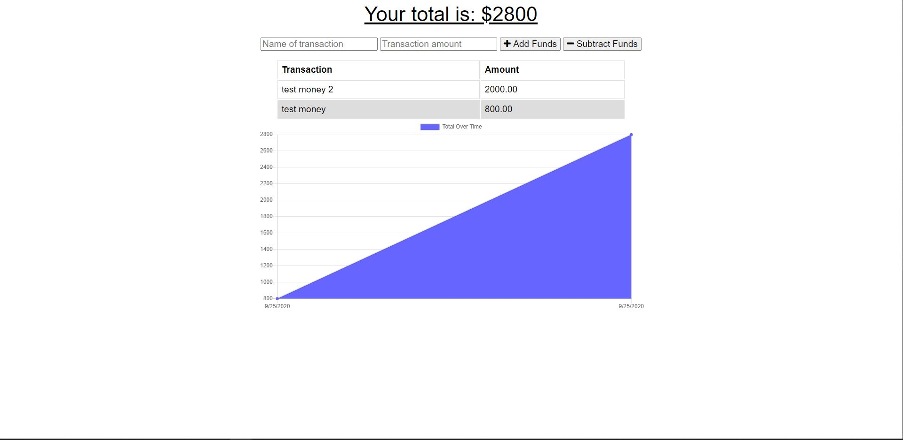

# budget-tracker

## Description

`Refactored application to track personal finance trends via interactive graph. Backend code utilizes NoSql database i.e. Mongo DB, hand built manifest, deployed to heroku, service-worker and indexedDB utilized to allow for offline functionality.`

## Screen-Shot

## Deployment 

* [budget-tracker](https://budget-trackerrrr.herokuapp.com/)

## Repo

* [Repo](https://github.com/Walker-Walker/budget-tracker)

